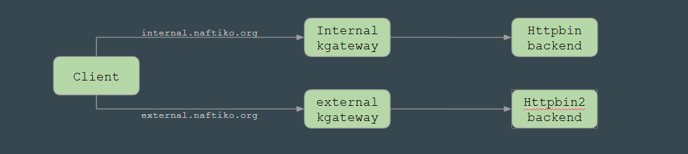

# Crossplane-Mock
An architecture project to test having a crossplane plane with two Kgateways and some mock APIs

Goal is to setup a k8s cluster with Crossplane as a controler pane and kgateway as a data pane. 

To validate the architecture we want to implement the simple network diagram below:

- Client calls either naftiko.org hostname
- proxies receive and route the the backend
- httpbin backend receives and responds to the request

See [howto.md](howto.md) for instructions on how to setup the p.o.c.
