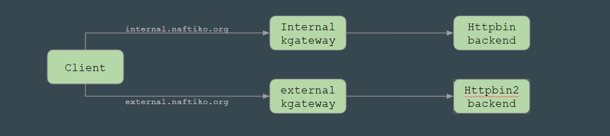

# Crossplane-Mock
An architecture project to test having a crossplane plane with two Kgateways and some mock APIs

Goal is to setup a k8s cluster with Crossplane as a controler plane and kgateway as a data plane. 

To validate the architecture we want to implement the simple network diagram below:

- Client calls either naftiko.org hostname
- Proxies receive and route a backend
- Backends receive and respond to the request
- One backhand is installed via helm, the other one with Crossplane as a provider

See [howto.md](howto.md) for instructions on how to setup the p.o.c.
